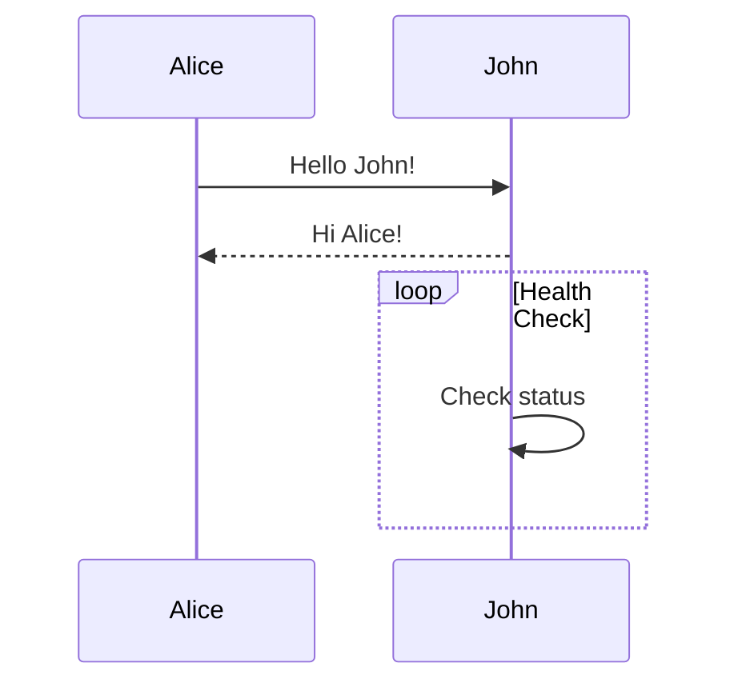

# Complete GitHub Flavored Markdown Example

1. [Basic Syntax](#basic-syntax)
2. [Inline Blocks](#inline-blocks)
3. [GFM Exclusive Features](#exclusive-features)
4. [Extended Features](#extended-features)

---

## Basic Syntax

# H1

## H2

### H3

#### H4

##### H5

###### H6

**Bold** (`**text**`)  
_Italic_ (`*text*`)  
~~Strikethrough~~ (`~~text~~`)  
==Highlight== (`==Highlight==`)requires extension  
**_Combined Emphasis_** (`***text***`)

- Primary item
  - Nested item (indent 2 spaces)
    - Third level (indent 4 spaces)

* Alternative symbol

- Another style

1. First item
2. Second item
   1. Nested item (indent 3 spaces)
3. Auto-corrected to 3

---

## Inline blocks

[GitHub link](https://github.com)


Sized image: 

Use `print("Hello World")` function in `python`.

```cpp
#include<iostream>

int main() {
    std::cout << "Hello, World!" << std::endl;
    return 0;
}
```

> Primary quote
>
> > Nested quote
>
> - With list
>   `With code`

---

## Exclusive Features

| Syntax    |    Description    |          Extras |
| :-------- | :---------------: | --------------: |
| **Bold**  |    Normal text    |          `Code` |
| [Link](#) |  Mixed elements   |        Emoji 😄 |
| Alignment | Left/Center/Right | Complex content |

- [x] Completed task
- [ ] Pending task
  - [ ] Sub-task 1
  - [x] Sub-task 2

This sentence has one footnote[^note1], and another[^note2]

[^note1]: Primary footnote (appears at bottom)
[^note2]:
    Secondary footnote (supports  
    multi-line content with indentation)

URL: https://www.github.com  
Email: contact@example.com

Standard: :+1: :rocket:

> [!NOTE]  
> Highlights information that users should take into account, even when skimming.

> [!TIP]
> Optional information to help a user be more successful.

> [!IMPORTANT]  
> Crucial information necessary for users to succeed.

> [!WARNING]  
> Critical content demanding immediate user attention due to potential risks.

> [!CAUTION]
> Negative potential consequences of an action.

---

## Extended Features

<details>
<summary>Click to expand</summary>

**Hidden Content**: Supports all Markdown & Nested elements

```javascript
console.log("Hidden Code");
```

</details>

Inline: $\sqrt{3x-1}+(1+x)^2$

Block:

$$
\begin{bmatrix}
a & b \\
c & d
\end{bmatrix}
$$



<kbd>Ctrl</kbd>+<kbd>S</kbd> Save  
Progress: <progress value="75" max="100"></progress>  
Comment: <!-- Hidden comment -->
