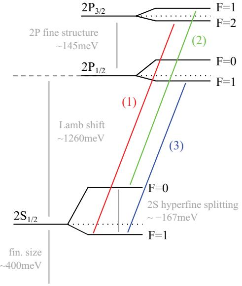
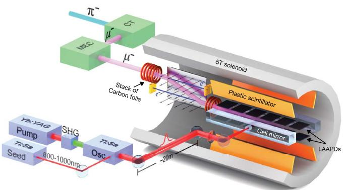
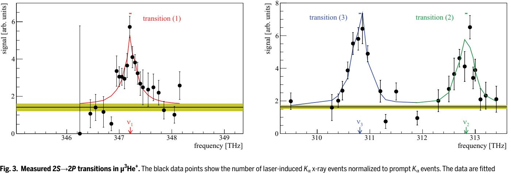
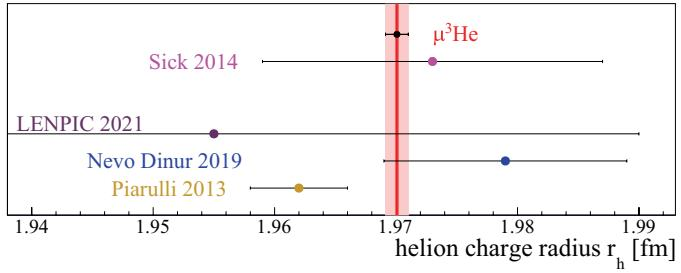
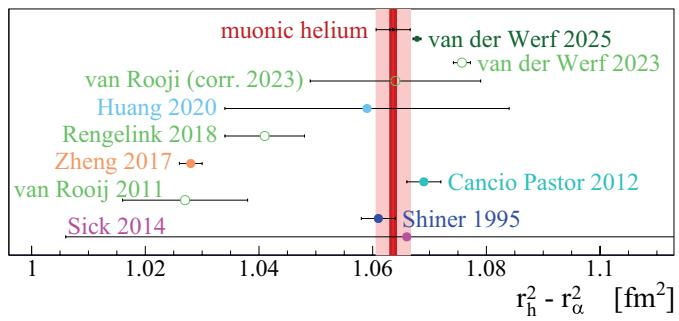

# **ATOMIC PHYSICS**

# **The helion charge radius from laser spectroscopy of muonic helium-3 ions**

Karsten Schuhmann[1](#page-0-0), Luis M. P. Fernandes[2](#page-0-1), François Nez[3](#page-0-2), Marwan Abdou Ahmed[4](#page-0-3), Fernando D. Amaro[2](#page-0-1), Pedro Amaro[5](#page-0-4), François Biraben[3](#page-0-2), Tzu-Ling Chen[6](#page-0-5), Daniel S. Covita[7](#page-0-6), Andreas J. Dax[8](#page-0-7), Marc Diepold[9](#page-0-8), Beatrice Franke[9](#page-0-8), Sandrine Galtier[3](#page-0-2), Andrea L. Gouvea[2](#page-0-1), Johannes Götzfried[9](#page-0-8), Thomas Graf[4](#page-0-3), Theodor W. Hänsch[9](#page-0-8)[,10](#page-0-9), Malte Hildebrandt[8](#page-0-7), Paul Indelicato[3](#page-0-2), Lucile Julien[3](#page-0-2), Klaus Kirch[1](#page-0-0)[,8](#page-0-7), Andreas Knecht[8](#page-0-7), Franz Kottmann[1](#page-0-0)[,8](#page-0-7), Julian J. Krauth[9](#page-0-8)[,11](#page-0-10), Yi-Wei Liu[6](#page-0-5), Jorge Machado[5](#page-0-4), Cristina M. B. Monteiro[2](#page-0-1), Françoise Mulhauser[9](#page-0-8), Boris Naar[1](#page-0-0), Tobias Nebel[9](#page-0-8), Joaquim M. F. dos Santos[2](#page-0-1), José Paulo Santos[5](#page-0-4), Csilla I. Szabo3, David Taqqu1,8, João F. C. A. Veloso7, Andreas Voss4, Birgit Weichelt4, Aldo Antognini1,8[\\*](#page-0-11), Randolf Pohl9,11[\\*;](#page-0-11) The CREMA Collaboration

Hydrogen-like light muonic ions, in which one negative muon replaces all of the electrons, are extremely sensitive probes of nuclear structure. Using pulsed laser spectroscopy, we have measured three 2*S*-2*P* transitions in the muonic helium-3 ( $\mu$ 3He+) ion, an ion formed by a negative muon and bare helium-3 nucleus. This allowed us to extract the Lamb shift, the 2*P* fine structure splitting, and the 2*S*-hyperfine splitting in  $\mu$ 3He+. Comparing these measurements with theory, we determined the root-mean-square charge radius of the helion (3He nucleus) to be *r*h = 1.97007(94) fm, in good agreement with the value from elastic electron scattering but a factor 15 more accurate. Our results represent benchmarks for fewnucleon theories and open the way for precision quantum electrodynamics tests in He atoms and ions.

The exceptional simplicity of light atomic systems with one or two electrons, such as H, D, He+, or He, coupled with the ability to investigate them through laser spectroscopy, offers an outstanding opportunity to test and advance the theory of atomic energy levels. The exquisite relative precision achieved by current experiments and theory (*1*, *2*), however, requires precise knowledge of the root-meansquare (rms) nuclear charge radii. The extended nuclear charge distribution, which is in leading order parameterized by the rms radius, modifies the Coulomb potential inside the nucleus. This in turn leads to subtle shifts of energy levels on the order of 10–9 or smaller in light electronic atoms, highlighting the need for measuring rms radii with a precision better than 10–3. This is currently not matched by elastic electron scattering (*[3](#page-4-2)*), which has traditionally provided nuclear radii.

Nuclear radii play an increasingly important role in nuclear physics, too. The radius of the 3He nucleus presented here is expected to improve our understanding of ab initio few-nucleon theory and threenucleon forces, which have been shown to be crucial for our understanding of nuclei (*4*–*6*).

Outstanding sensitivity to nuclear properties such as the charge radius is provided by laser spectroscopy of muonic atoms and ions (*7*">–*10*), where a single negative muon is orbiting a bare nucleus. This is because the muon mass is 200 times larger than the electron mass, which results in a  $200^3 \approx 10^7$  enhanced overlap of the atomic wavefunction with the nucleus. Indeed, the leading-order finite-nuclear-size effect scales with the third power of the (reduced) mass of the orbiting particle. In SI units, this finite size effect reads (*[1](#page-4-0)*)

$$
\Delta E\_{\rm FNS}(n,l) = \frac{2c^4}{3\hbar^2} \frac{\langle Za \rangle^4}{n^3} m\_r^3 r^2 \delta\_{10} \tag{1}
$$

where *n* is the principal quantum number, *l* the angular momentum, *c* the speed of light, *ħ* the reduced Planck constant,  $\alpha$  the fine structure constant, *Z* the atomic number, *m*r the reduced mass, and *r* the rms charge radius of the nucleus. The Kronecker  $\delta\_{10}$  indicates that only *S*-state energy levels are affected in leading approximation by the finite size because of their wave function overlap with the nucleus.

Here, we present the measurement of three 2*S*→2*P* transitions of the muonic helium-3 ion  $\mu$ 3He+ (a two-body ion formed by a negative muon and a bare 3He nucleus) as shown in [Fig. 1,](#page-1-0) from which we extracted the 2*S*-2*P* Lamb shift, the 2*S* hyperfine splitting (HF*S*), and the 2*P* fine splitting. From the Lamb shift, we have then extracted the rms charge radius of the 3He (helion) nucleus *r*h with a relative precision of 7 × 10–4, improving the previous best value (*3*) from elastic electron scattering by a factor of 15. From the comparison between 2*S* HFS and theory, we extracted the two-photon-exchange contribution which is the leading-order nuclear structure dependent contribution for the hyperfine splitting.

The 2*S*-2*P* transition frequencies were measured by pulsed laser spectroscopy at wavelengths around 850 to 940 nm (frequencies of 310 to 350 THz) to an accuracy of ~20 GHz corresponding to relative accuracies of ~50 ppm. The resonances were exposed by detecting the *K*α x-ray of 8 keV energy emitted from 2*P*→1*S* de-excitation after a successful laser transition from the 2*S* to the 2*P* state. The 50-ppm measurement precision has to be compared with the energy shift caused by the finite-size effect [\(Eq. 1\)](#page-0-12) that contributes as much as 25% to the 2*S*-2*P* energy splitting due to its  $m\_r^3Z^4$  dependence. The binding energy of this hydrogen-like system, scaling as  $Z^2m\_r$ , is strongly enhanced compared with hydrogen, whereas the atomic size (Bohr radius), scaling as  $1/Zm\_r$ , is strongly reduced, making this atom virtually immune to external perturbation. Because of its  $m\_rZ^4$  dependence, the decay rate from the 2*P* state is also vastly increased compared with normal atoms, resulting in a 2*P*-linewidth of 319 GHz. This broad linewidth represents by far the main limitation to our experimental precision.

## **Principle and experimental setup**

The experiment was performed at the CHRISP facility at the Paul Scherrer Institute, where μ3He+ ions are formed in highly excited states by stopping a keV-energy muon in a low-pressure (2 mbar) 3He gas target at room temperature and placed in a 5 T solenoid [\(Fig. 2\)](#page-1-1). The newly formed  $\mu$ 3He+ ions de-excite to the 1*S* state in a fast (nanosecondscale) and complex cascade process with a fraction of ~1%, reaching the metastable 2*S* state with a lifetime of ~1.7  $\mu$ s at this low target pressure. This lifetime is sufficiently long to enable triggering of our pulsed laser to perform spectroscopy of the 2*S*-2*P* splitting.

1Institute for Particle Physics and Astrophysics, ETH Zurich, Zurich, Switzerland. 2LIBPhys, Physics Department, Universidade de Coimbra, Coimbra, Portugal. 3Laboratoire Kastler Brossel, UPMC-Sorbonne Universités, CNRS, ENS-PSL Research University Collège de France, Paris, France. 4Institut für Strahlwerkzeuge, Universität Stuttgart, Stuttgart, Germany. 5Laboratório de Instrumentação, Engenharia Biomédica e Física da Radiação (LIBPhys-UNL) e Departamento de Física da Faculdade de Ciências e Tecnologia da Universidade Nova de Lisboa, Monte da Caparica, Caparica, Portugal. 6Physics Department, National Tsing Hua University, Hsincho, Taiwan. 7i3N, Universidade de Aveiro, Campus de Santiago, Aveiro, Portugal. 8PSI Center for Neutron and Muon Sciences, Villigen PSI, Switzerland. 9 Max-Planck-Institut für Quantenoptik, Garching, Germany. 10Faculty of Physics, Ludwig-Maximilian Univer[sity of Munich, Munich,](mailto:aldo.​antognini@​psi.​ch) Germany. 11Johannes Gutenberg Universität Mainz, Institut für Physik, QUANTUM, & Exzellenzcluster PRISMA+, Mainz, Germany. \*Corresponding author. Email: aldo.antognini@psi.ch (A.A.); [pohl@uni-mainz.de](mailto:pohl@​uni-mainz.​de) (R.P.)

To this end, a muon entering the target is detected (*7*, *11*) and triggers a laser system that delivers a pulse to excite the 2*S* into the 2*P* state after a delay of ~1 μs. The laser pulse is injected into a multipass cell formed by two elongated mirrors that fold the light back and forth to illuminate the elongated muon stopping volume. A successful laser excitation is established by detecting the 8-keV energy *K* $\alpha$  x-ray from the 2*P* de-excitation into the ground state. This is accomplished using two rows of large area avalanche photodiodes (LAAPDs) placed above and below the muon stopping volume, respectively, and covering 30% solid angle. The 2*S*-2*P* resonances are eventually obtained by plotting the number of *K* $\alpha$  x-rays detected in time coincidence with the laser light as a function of the laser frequency. For more details on the experiment, see (*12*).

**Fig. 1. Energy levels.** Shown is the scheme (not to scale) of the *n* = 2 energy levels in  $^{3}$ He $^{+}$  and the measured transitions. The inverted ordering of the hyperfine levels is caused by the negative magnetic moment of the helion.

**Fig. 2. Sketch of the experimental setup.** CT, cyclotron trap; MEC, muon extraction channel; Ti:Sa, titanium-sapphire laser; Yb, YAG thin-disk laser; SHG, second harmonic generation. The arrows indicate the electric field of the *E* × *B* Wien filter. Muons entering the target are detected through the electrons generated in two stacks of carbon foils. The laser pulses are coupled in the multipass cell through a hole in one of the cell mirrors. LAAPDs are placed above and below the muon stopping volume.

# **Measurements and data analysis**

The events used to expose the three 2*S*-2*P* resonances shown in [Fig. 1](#page-1-0)  had to fulfill the following sequence: a muon is detected in the entrance counter, a *K* $\alpha$  x-ray is detected in the LAAPDs in time coincidence with the laser light in the cavity, and a decay electron is detected afterward in the electron counters (or LAAPDs). To obtain the resonances shown in [Fig. 3](#page-2-0), the number of these events is plotted versus the laser frequency and normalized to the number of prompt *K* $\alpha$  x-rays so that variations of the number of muons and x-ray detection efficiency do not affect the results. The laser frequency was alternated on the two sides of the resonance every 1 to 2 hours to reduce a possible distortion of the measured resonance due to variations of the performance of the experimental setup. The injected pulse energy was limited to 5 mJ to minimize saturation effects and optically induced damage of the cavity coating. Because a minimum pulse-to-pulse separation of ~2 ms was imposed on the laser system for increased stability, about half of the entering muons did not trigger the laser system. However, these "laser-off events" were used to precisely measure the average background, yielding the yellow bands in [Fig. 3](#page-2-0).

Transition (1) took ~2 weeks of continuous measurement; transitions (2) and (3) were measured together, with ~3 weeks of continuous data taking. For the first transition, on resonance, we observed a rate of ~7 events/h including a background rate of ~2 events/h.

The center frequency of the measured lines was obtained by fitting the data with a line shape model. The model is a Lorentzian that accounts for the laser pulse energy measured for every pulse. It can therefore only be evaluated at the position of each data point. This leads to the distortion in the line shape seen in [Fig. 3](#page-2-0). From the line shape fit we obtain the following transition frequencies:

$$\nu\_{\rm exp}^{(1)} \equiv \nu \left( 2P\_{3/2}^{F=2} - 2S\_{1/2}^{F=1} \right) = 347.212(20)^{\rm stat} (1)^{\rm sys} \text{ THz} \tag{2}$$

$$\nu\_{\text{exp}}^{(2)} \equiv \nu \left( 2P\_{3/2}^{F=1} - 2S\_{1/2}^{F=0} \right) = 312.830 \text{(21)}^{\text{stat}} \text{(1)}^{\text{sys}} \text{ THz} \tag{3}$$

$$\nu\_{\text{exp}}^{(3)} \equiv \nu \left( 2P\_{1/2}^{F=1} - 2S\_{1/2}^{F=1} \right) = 310.814 \text{(20)}^{\text{stat}} \text{(1)}^{\text{sys}} \text{ THz} \tag{4}$$

The fit was done with a fixed linewidth of  $\Gamma$  = 318.7 GHz at FWHM, given by the 2*P* decay rate (*13*, *14*). A separate fit with a free width resulted in widths that agreed with the theoretical one. The total uncertainty of about 20 GHz, corresponding to ~6  $\times$  10–2  $\Gamma$ , is dominated by statistics. The combined systematic uncertainty of each transition frequency is 1 GHz (*12*).

The measured transition frequencies [Eqs. 2](#page-1-2) to [4](#page-1-3) yield the energy splittings

$$
\Delta E\_{\text{exp}}^{(1)} = 1435.951(81) \text{ meV} \tag{5}
$$

$$
\Delta E\_{\text{exp}}^{(2)} = 1293.759(86) \text{ meV} \tag{6}
$$

$$
\Delta E\_{\text{exp}}^{(3)} = 1285.425(81) \text{ meV} \tag{7}
$$

through the relation 1 meV ≙ 241.798935 GHz. The uncertainties given here are the total experimental uncertainties, which are completely dominated by statistics.

## **Experimental results**

From the three transition measurements between 2*S* and 2*P* states with different fine and hyperfine sublevels, it is possible to determine three quantities: we choose the Lamb shift  $E$ LS =  $\Delta$ *E*(2*P*1/2 – 2*S*1/2), the 2*S* hyperfine splitting *E*HFS, and the 2*P* fine splitting  $E$ FS =  $\Delta$ *E*(2*P*3/2

3**He**+**.** The black data points show the number of laser-induced *K*α x-ray events normalized to prompt *K*α events. The data are fitted with a line shape model detailed in the main text. This model applies only at the measured points, and the colored lines only connect the fit points. The fitted center frequencies including their uncertainties are indicated by the colored points with error bar above the resonances. The yellow bands indicate the average ±1σ backgrounds obtained from events where the laser was not fired.

– 2*P*1/2). The relations between the measured transition energies and these quantities are given by (*12*):

$$
\Delta E\_{\rm exp}^{(1)} = E\_{\rm LS} - \frac{1}{4} E\_{\rm HFS} + E\_{\rm FS} - 9.23945(26) \,\text{meV} \tag{8}
$$

$$
\Delta E\_{\rm exp}^{(2)} = E\_{\rm LS} + \frac{3}{4} E\_{\rm HFS} + E\_{\rm FS} + 15.05305(44) \,\text{meV} \tag{9}
$$

$$
\Delta E\_{\rm exp}^{(3)} = E\_{\rm LS} - \frac{1}{4} E\_{\rm HFS} - 14.80851(18)\,\text{meV} \tag{10}
$$

where *E*HFS < 0 and the numerical values of the last terms in [Eqs. 8](#page-2-1) to [10](#page-2-2) arise from the 2*P* fine and hyperfine splittings, and include the contribution from the mixing of the *F* = 1 levels. These contributions can be calculated with great precision because the 2*P* wave function of the hydrogen-like muonic He ion has negligible overlap with the nucleus, resulting in negligible contributions from nuclear size and structure corrections.

The two most recent theory papers (*15*, *16*) used different conventions for the definition of the 2*P*1/2 and 2*P*3/2 centroids, which results in differing definitions of the Lamb shift. To obtain the constant terms in [Eqs. 8](#page-2-1) to [10](#page-2-2), we have used the 2*P* levels calculated in (*15*) and modified them to account for the different definitions (*12*) such that our final result for the Lamb shift follows the convention of (*16*).

We can solve the system of equations to obtain the experimental values of the Lamb shift, the 2*S* HFS und the 2*P* fine splitting:

$$E\_{\rm LS}^{\rm exp} = 1258.612(86) \text{ meV} \tag{11}$$

$$E\_{\rm HFS}^{\rm exp} = -166.485(118) \text{ meV} \tag{12}$$

$$E\_{\rm FS}^{\rm exp} = 144.958(114) \text{ meV} \tag{13}$$

The experimental value of the fine splitting  $E\_{\text{FS}}^{\text{exp}}$  is in excellent agreement with predictions  $E\_{\text{FS}}^{\text{theo}} = 144.979(5)$  meV (*15*), demonstrating consistency between our three muonic transitions measurements, as well as the correctness of the theory of the 2*P* fine structure. Because of its much smaller uncertainty and consistency with measurements, we can use the theory value of the fine splitting to solve the system of equations [Eqs. 8](#page-2-1) to [10](#page-2-2) to obtain improved values of the Lamb shift and 2*S* HFS

$$E\_{\rm LS}^{\rm exp} = 1258.598 \text{(48)}^{\rm exp} \text{(3)}^{\rm theo} \text{ meV} \tag{14}$$

$$E\_{\rm HFS}^{\rm exp} = -166.496(104)^{\rm exp}(3)^{\rm theo} \text{ meV} \tag{15}$$

The theoretical uncertainties are from the ±0.005 meV estimated higher-order corrections to the fine structure in (*15*), which affects only two of the three measured transitions.

### **The helion charge radius and the isotope shift**

tive corrections to it. The last term

The theory prediction of the Lamb shift has been recently updated accounting for the contributions of various groups. It reads (*[16](#page-4-12)*):

$$E\_{\rm LS}^{\rm theo} (r\_h^{\,2}) = 1644.348(8) \,\text{meV} - 103.383(1) \, r\_h^{\,2} \,\text{meV/fm}^2 + E\_{\rm LS}^{\rm nucl.struct.}$$
(16)  
where the first term accounts for all quantum electrodynamics (QED) corrections independently of the nuclear structure, and the term proportional to  $r\_h^{\,2}$  accounts for the finite-size correction including radiation.

$$E\_{\rm LS}^{\rm nucl.struct.} = 15.499(378) \text{ meV} \tag{17}$$

is the sum of nuclear structure dependent contributions (*17* is dominated by the nuclear two- and three-photon exchange contributions (2PE and 3PE, respectively). Here, the 2PE amounts to 16.38(31) meV, of which 0.647(55) meV is from the individual nucleons. The full 3PE has not been calculated explicitly, and we use the conventional scaling from the calculated elastic 3PE (*10*, *19*). Comparing this theory prediction with the measured Lamb shift  $E\_{\text{LS}}^{\text{exp}}$ , we obtain the rms charge radius of the helion

$$r\_h = 1.97007(12)^{\exp}(93)^{\text{theo fm}} \text{ fm} = 1.97007(94) \text{ fm} \tag{18}$$

This value is 15 times more precise than the previous best value from elastic electron-3He scattering of 1.973(14) fm (*3*) and consistent with it ([Fig. 4](#page-3-0)).

Our value could be further improved by almost an order of magnitude by advancing the calculations leading to [Eq. 17](#page-2-3), both for the nucleus and the nucleons (*16*, *18*, *20*).

It is interesting to compare this value with the helion charge radius as obtained from most recent nuclear theories, which uses chiral effective field theory to describe the nuclear interaction and ab initio

## **Research Articles**

**Fig. 4.** Recent determinations of the 3He nucleus (helion) charge radius. The dark and light bands indicate the experimental and total uncertainty in our measurement. The value of Sick of 1.973(14) fm (*3*) is from the world data on elastic electron scattering. The other values are recent predictions from nuclear few-body theory: Piarulli and colleagues, 1.962(4) fm (*[21](#page-4-17)*, *[22](#page-4-32)*); Nevo Dinur *et al.*, 1.979(10) fm (*[50](#page-4-33)*); and the LENPIC collaboration, 1.955(34) fm (*[24](#page-4-34)*, *[25](#page-4-18)*). The latter value was obtained using the point-proton structure radius and procedure explained in (*[24](#page-4-34)*).

**Fig. 5.** Squared charge radius difference  $r\_h^2 - r\_\alpha^2$ . The isotope shift in ordinary He atoms (*[2](#page-4-1)*, *[27](#page-4-20)*–*[32](#page-4-21)*, *[34](#page-4-23)*) is compared to our value from muonic ions. The dark and light bands indicate the experimental and total uncertainty of our determination. The values of Shiner *et al.* (*[27](#page-4-20)*) and Cancio Pastor *et al.* (*[29](#page-4-35)*) have been corrected for improved theory calculations (*[26](#page-4-19)*) but may lack a systematic correction associated with quantum interference effects (*[55](#page-4-36)*), as suggested in (*[35](#page-4-24)*). The value of Zheng *et al.*  (*[31](#page-4-37)*) may have to be corrected for a systematic Doppler shift (*[36](#page-4-25)*). The most recent work from Amsterdam by van der Werf (*[2](#page-4-1)*) supersedes the results from van Rooij (*[28](#page-4-38)*) and Rengelink (*[32](#page-4-21)*) and gives an updated result of (*[28](#page-4-38)*). Good agreement is found when the hyperfine mixing in ordinary helium (*[37](#page-4-26)*, *[38](#page-4-27)*) is accounted for in van der Werf *et al.* (*[2](#page-4-1)*). Another precise value is soon expected from the ionization energy in metastable helium (*[51](#page-4-39)*).

methods to solve the quantum-mechanical few-body problem. [Figure 4](#page-3-0) shows some of the most recent results taken from (*[21](#page-4-17)*–*[25](#page-4-18)*) depicting an overall satisfactory agreement between the measured value and the various predictions and highlighting the role of the helion charge radius as a benchmark for precision nuclear theory.

Spectroscopy of ordinary helium atoms cannot yet provide precise values of the helion and alpha-particle charge radii given the present uncertainty of the three-body atomic theory. However, in the isotope shift, several cancellations take place in the theory (*[26](#page-4-19)*) of the energy levels so that an accurate determination of the squared charge radius difference  $r\_h^2 - r\_\alpha^2$  is possible (*27*\n 4He) charge radius. The scattering of the values obtained so far shown in [Fig. 5](#page-3-1), however, reveals some tensions that highlight the challenges faced by both theory and experiments.

It is therefore interesting to address this quantity by considering the isotope shift in muonic helium ions (*16*, *33*)

$$\left(r\_h\right)^2 - r\_\alpha^{-2} = -\frac{E\_{\rm LS}^{\rm exp}\left(\mu^3 \text{He}^+\right)}{103.383 \frac{\text{meV}}{\text{fm}^2}} + \frac{E\_{\rm LS}^{\rm exp}\left(\mu^4 \text{He}^+\right)}{106.209 \frac{\text{meV}}{\text{fm}^2}} + 0.2585(30) \,\text{fm}^2 \quad (19)$$

$$r\_h^{-2} - r\_a^{-2} = 1.0636(6)^{\text{exp}}(30)^{\text{theo}} \text{ fm}^2 \tag{20}$$

where the theory uncertainty is dominated by the nuclear 2PE. The value in [Eq. 20](#page-3-2) can be compared with various isotope shift measurements obtained in regular He atoms with two electrons ([27](#page-4-20)–[32](#page-4-21), [34](#page-4-23)), where long-standing discrepancies exist ([Fig. 4](#page-3-0)). Several systematic shifts were recently identified in these measurements (*[2](#page-4-1)*, *[35](#page-4-24)*, *[36](#page-4-25)*). Initially, our result deviated by 3.6σ from the most recent and most precise value by the Amsterdam group (*[2](#page-4-1)*). However, recent calculations of the hyperfine mixing in ordinary helium ([37](#page-4-26), [38](#page-4-27)) brought the Amsterdam value in agreement with our result.

Our measurements in muonic helium ions do not require the exquisite experimental accuracy of 10-12 reached in ordinary helium atoms and are not sensitive to systematic effects. Conversely, our results are limited by the nuclear structure effects of  $E\_{LS}^{\text{nucl.struct.}}$ , which are much larger in muonic systems ([18](#page-4-15), [23](#page-4-28), [39](#page-4-29)–[42](#page-4-30)).

For completeness, we quote here the updated Lamb shift theory in  $\mu^{4}$ He+ from ([16](#page-4-12))

$$E\_{\rm LS}^{\rm theo}(r\_a^{\rm 2}) = 1668.491(7) \text{meV} - 106.209 r\_a^{\rm 2} \text{ meV/fm}^2$$

$$+9.276(433)\text{ meV}\tag{21}$$

Combined with the Lamb shift in  $\mu^{4}$ He+ that we have measured in (*10*), this yields an updated 4He charge radius of  $r\_{\alpha} = 1.6786(12)$  fm with a 45% larger uncertainty compared with our previous determination, which used the theory summarized in (*33*). The new  $r\_{\alpha}$  was obtained using the 2PE contribution calculated solely from ab initio theory (*[18](#page-4-15)*), whereas previously, we split it into a third-Zemach moment (Friar radius) contribution obtained from electron elastic scattering and a polarizability contribution from few-nucleon theories (*[18](#page-4-15)*). Because this splitting could lead to some inconsistencies (*[16](#page-4-12)*), we now opt for the solution fully based on few-body theories (*18*).

## **Nuclear-structure contribution for the 2***S* **HF***S*

By comparing the measured 2*S* HFS  $E\_{\text{HFS}}^{\text{exp}}$  in  $\mu$ 3He+ with the corresponding theory prediction (*[43](#page-4-31)*)

$$E\_{\rm HFS}^{\rm theo} = -172.7457(89) \text{ meV} + E\_{\rm HFS}^{\rm nucl.strract.} \tag{22}$$

we extract the nuclear structure-dependent contributions (2PE and higher orders) to the 2*S* hyperfine splitting

$$E\_{\text{HFS}}^{\text{nucl.struct.}} = 6.25(10) \text{ meV} \tag{23}$$

with an uncertainty arising almost entirely from the statistical uncertainties of our measurements. Subtracting from  $E\_{\text{HFS}}^{\text{nucl.struct.}}$  the elastic part of the two-photon-exchange contribution  $\Delta E\_{2PE}^{\text{Zemach}} = 2.5836$  meV/fm  $r\_Z = 6.53(4)$  meV, where  $r\_Z = 2.528(16)$  fm is the Zemach radius of the 3He nucleus (*3*, *23*), we can obtain a value for the hitherto unknown polarizability contribution to the 2*S* hyperfine splitting of  $-0.28(10)$  meV (that includes also higherorder contributions). This represents an important benchmark to refine our understanding of the magnetic structure of the 3He nucleus. It also allows us, using appropriate scaling, to predict the nuclear structure contribution of the ground-state hyperfine splitting in  $\mu$ 3He+, restricting considerably the range where we can search for this resonance.

# **Discussion and outlook**

Laser spectroscopy of 3He+ and 4He+ (*10*) ions provides precision values of 3He and 4He charge radii and the isotope shift ([Eq. 20](#page-3-3)). These are low-energy observables for ab initio nuclear structure theory, complementing nuclear binding energies and magnetic moments.

## **Research Articles**

They can serve as benchmarks for few-body calculations and the systematic development of the many-body nuclear potential and electromagnetic currents used in these calculations (*4*, *21*-*23*, *44*-*46*).

In the near future, measurements in ordinary He+ (*47*, *48*), together with the radii presented here, can be used to test the QED theory for H-like two-body systems (*20*, *49*), with particular sensitivity to higherorder corrections that scale with high powers of  $(Z\alpha)^{5...8}$ .

Eventually, these measurements in ordinary He+ may determine the nuclear charge radii with even better accuracy than the ones given here. In muonic atoms, the nuclear structure effects (2PE and 3PE) are enhanced by (at least) another power of the lepton mass relative to the finite-size effect. They are thus the main source of uncertainty for the radii from muonic atoms ([Eq. 16](#page-2-5)) but play a small role in electronic atoms (*49*). Such a precise charge radius from electronic atoms, combined with [Eqs. 11](#page-2-4) and [16](#page-2-5), will then yield  $E\_{LS}^{\text{nucl.struct.}}$  from experiment, providing an improved benchmark for nuclear structure calculations (*18*, *39*, *41*, *42*, *50*).

The charge radii from muonic ions are also essential for comparing measurements (*2*, *27*-*32*, *34*, *51*) and theory in the neutral He atoms, which have experienced notable advances in recent years (*[52](#page-4-46)*). This ultimately opens the way for precision testing of the challenging threebody QED with two electrons and an independent determination of the Rydberg constant from systems with *Z* = 2.

Finally, comparison of results from electronic (*[2](#page-4-1)*) and muonic systems can be used to search for physics beyond the Standard Model (*53*, *54*).

#### **REFERENCES AND NOTES**

- 1. E. Tiesinga, P. J. Mohr, D. B. Newell, B. N. Taylor, *Rev. Mod. Phys.* 93, 025010 [\(2021](#page-0-13)).
- 2. Y. van der Werf, K. Steinebach, R. Jannin, H. L. Bethlem, K. S. E. Eikema, *Science* 388,
- 850–853 [\(2025\)](#page-0-14).
- 3. I. Sick, *Phys. Rev. C* 90, 064002 [\(2014](#page-0-15)).
- 4. H.-W. Hammer, S. König, U. van Kolck, *Rev. Mod. Phys.* 92, 025004 [\(2020\)](#page-0-16).
- 5. E. Epelbaum *et al.*, *Phys. Rev. C* 66, 064001 (2002).
- 6. E. Epelbaum, H. Krebs, P. Reinert, *Front. Phys.* 8, 98 [\(2020\)](#page-0-17).
- 7. R. Pohl *et al.*, *Nature* 466, 213–216 [\(2010\)](#page-0-18).
- 8. A. Antognini *et al.*, *Science* 339, 417–420 (2013).
- 9. R. Pohl *et al.*, *Science* 353, 669–673 (2016).
- 10. J. J. Krauth *et al.*, *Nature* 589, 527–531 [\(2021\)](#page-0-19).
- 11. M. Mühlbauer *et al.*, *Hyp. Interact.* 119, 305–310 ([1999](#page-1-4)).
- 12. See the supplemetary materials.
- 13. P. Amaro *et al.*, *Phys. Rev. A* 92, 022514 [\(2015\)](#page-1-5).
- 14. P. Amaro *et al.*, *SciPost Phys.* 13, 020 ([2022\)](#page-1-6).
- 15. S. G. Karshenboim, E. Y. Korzinin, V. A. Shelyuto, V. G. Ivanov, *Phys. Rev. A* 96, 022505 [\(2017\)](#page-2-6).
- 16. K. Pachucki *et al.*, *Rev. Mod. Phys.* 96, 015001 [\(2024](#page-2-7)).
- 17. C. E. Carlson, M. Gorchtein, M. Vanderhaeghen, *Phys. Rev. A* 95, 012506 ([2017\)](#page-2-8).
- 18. C. Ji, S. Bacca, N. Barnea, O. J. Hernandez, N. Nevo Dinur, *J. Phys. G Nucl. Part. Phys.* 45, 093002 ([2018\)](#page-2-9).
- 19. K. Pachucki, V. Patkóš, V. A. Yerokhin, *Phys. Rev. A* 97, 062511 ([2018\)](#page-2-10).
- 20. A. Antognini, F. Hagelstein, V. Pascalutsa, *Annu. Rev. Nucl. Part. Sci.* 72, 389–418 ([2022](#page-2-11)).
- 21. L. E. Marcucci *et al.*, *J. Phys. G Nucl. Part. Phys.* 43, 023002 ([2016](#page-3-4)).
- 22. M. Piarulli *et al.*, *Phys. Rev. C* 87, 014006 [\(2013\)](#page-3-5).
- 23. N. Nevo Dinur *et al.*, *Phys. Rev. C* 99, 034004 [\(2019\)](#page-3-6).
- 24. P. Maris *et al.*, *Phys. Rev. C* 103, 054001 ([2021](#page-3-7)).
- 25. P. Maris *et al.*, *Phys. Rev. C* 106, 064002 [\(2022](#page-3-8)).
- 26. K. Pachucki, V. A. Yerokhin, *Phys. Rev. A* 95, 062510 [\(2017\)](#page-3-9).
- 27. D. Shiner, R. Dixson, V. Vedantham, *Phys. Rev. Lett.* 74, 3553–3556 [\(1995\)](#page-3-10).
- 28. R. van Rooij *et al.*, *Science* 333, 196–198 [\(2011\)](#page-3-11).
- 29. P. Cancio Pastor *et al.*, *Phys. Rev. Lett.* 108, 143001 ([2012](#page-3-12)).
- 30. V. Patkóš, V. A. Yerokhin, K. Pachucki, *Phys. Rev. A* 94, 052508 (2016).
- 31. X. Zheng *et al.*, *Phys. Rev. Lett.* 119, 263002 [\(2017](#page-3-13)).
- 32. R. J. Rengelink *et al.*, *Nat. Phys.* 14, 1132 ([2018\)](#page-3-14).
- 33. M. Diepold *et al.*, *Ann. Phys.* 396, 220–244 ([2018](#page-3-15)).
- 34. Y.-J. Huang, Y.-C. Guan, J.-L. Peng, J.-T. Shy, L.-B. Wang, *Phys. Rev. A* 101, 062507 ([2020\)](#page-3-16).
- 35. A. Marsman, E. A. Hessels, M. Horbatsch, *Phys. Rev. A* 89, 043403 [\(2014\)](#page-3-17).
- 36. J.-L. Wen *et al.*, *Phys. Rev. A* 107, 042811 ([2023](#page-3-18)).
- 37. X.-Q. Qi *et al.*, [arXiv:2409.09279 \[physics.atom-ph\]](https://doi.org/10.48550/arXiv.2409.09279) (2024).
- 38. K. Pachucki, V. Patkósš, V. A. Yerokhin, [arXiv:2411.05621 \[physics.atom-ph\]](https://doi.org/10.48550/arXiv.2411.05621) (2024).
- 39. O. J. Hernandez, C. Ji, S. Bacca, N. Barnea, *Phys. Rev. C* 100, 064315 ([2019](#page-3-19)).
- 40.A. A. Filin *et al.*, *Phys. Rev. C* 103, 024313 (2021).
- 41. B. Acharya, S. Bacca, F. Bonaiti, S. S. Li Muli, J. E. Sobczyk, [arXiv:2210.04632 \[nucl-th\]](https://doi.org/10.48550/arXiv.2210.04632)  (2022).
- 42. S. S. Li Muli, B. Acharya, O. J. Hernandez, S. Bacca, *J. Phys. G* 49, 105101 [\(2022](#page-3-20)).
- 43. B. Franke *et al.*, *Eur. Phys. J. D* 71, 341 ([2017\)](#page-3-21).
- 44. A. Ekström *et al.*, *Phys. Rev. C* 91, 051301 [\(2015\)](#page-4-49).
- 45. J. E. Lynn *et al.*, *Phys. Rev. C* 96, 054007 (2017).
- 46. J. Vanasse, *Phys. Rev. C* 98, 034003 [\(2018\)](#page-4-50).
- 47. J. Moreno *et al.*, *Eur. Phys. J. D* 77, 67 ([2023](#page-4-51)).
- 48. E. L. Gründeman *et al.*, *Commun. Phys.* 7, 414 [\(2024\)](#page-4-52).
- 49. S. G. Karshenboim, A. Ozawa, V. A. Shelyuto, R. Szafron, V. G. Ivanov, *Phys. Lett. B* 795, 432–437 ([2019](#page-4-53)).
- 50. N. Nevo Dinur *et al.*, *Phys. Rev. C* 99, 034004 [\(2019\)](#page-3-22).
- 51. G. Clausen *et al.*, *Phys. Rev. Lett.* 127, 093001 [\(2021\)](#page-3-23).
- 52. V. Patkóš, V. A. Yerokhin, K. Pachucki, *Phys. Rev. A* 103, 042809 ([2021](#page-4-54)).
- 53. C. Frugiuele, C. Peset, *J. High Energy Phys.* 2022, 2 ([2022\)](#page-4-55).
- 54. Y. V. Stadnik, *Phys. Rev. Lett.* 131, 011001 [\(2023](#page-4-56)).
- 55. R. C. Brown *et al.*, *Phys. Rev. A* 87, 032504 ([2013\)](#page-3-24).
- 56. K. Schuhmann *et al.*, The helion charge radius from laser spectroscopy of muonic helium-3 ions (OpenScience Project, 2025);<https://doi.org/10.25358/openscience-11269>.

### **ACKNOWLEDGMENTS**

This paper is dedicated to I. Sick and W. Vassen. We thank S. Bacca, N. Barnea, K. Eikema, E. Epelbaum, F. Hagelstein, S. Karshenboim, S. Li Muli, V. Lensky, L. Marcucci, U. Meißner, K. Pachucki, L. Simons, and K. Steinebach for fruitful discussions. **Funding:** This work was supported by the European Research Council (ERC StG grant 279765 and CoG grant 725039); the Deutsche Forschungsgemeinschaft (DFG, German Research Foundation) under Germany's Excellence Strategy EXC PRISMA+ (grant 390831469); European Union's Horizon 2020 research and innovation program (grant STRONG 2020 824093); FEDER and FCT (project PTDC/FIS-NUC/0843/2012; FCT grants SFRH/BPD/76842/2011, SFRH/ BPD/92329/2013, and SFRH/BD/52332/2013; and grant DFG\_GR\_3172/9-1); the Swiss National Science Foundation (SNSF grants 138175, 159755, 165854, 197052); and the ETH Femtosecond and Attosecond Science and Technology (ETH-FAST) initiatives as part of the NCCR MUST program. **Author contributions:** K.S., M.A.A., F.B., T.-L.C., A.D., M.D., S.G., T.G., T.W.H., L.J., K.K., F.K., J.J.K., Y.-W.L., B.N., F.N., D.T., J.F.C.A.V., A.V., B.W., A.A., and R.P. designed, built, and operated parts of the laser system. K.S., L.M.P.F., F.D.A., M.D., B.F., A.L.G., M.H., K.K., A.K., F.K., J.J.K., Y.-W.L., J.M., C.M.B.M., F.M., T.N., F.N., J.M.F.S., J.P.S., D.T., J.F.C.A.V., A.A., and R.P. planned, built, and set up the various detectors of the experiment. K.S., F.D.A., P.A., D.S.C., M.D., L.M.P.F., B.F., J.G., J.H., M.H., K.K., A.K., F.K., J.J.K., J.M., F.M., J.P.S., C.I.S., D.T., A.A., and R.P. designed, built, set up, and operated the muon beam line. K.S., F.D.A., M.D., L.M.P.F., B.F., A.K., F.K., J.J.K., J.M., C.M.B.M., F.M., F.N., J.M.F.S., D.T., A.A., and R.P. designed and implemented the electronics used in the experiment. P.A., M.D., A.K., J.J.K., J.P.S., J.V., R.P., and A.A. set up the computing infrastructure, wrote software, and realized the data acquisition system. K.S., F.D.A., P.A., D.S.C., A.J.D., M.D., L.M.P.F., B.F., S.G., J.G., A.L.G., P.I., L.J., A.K., F.K., J.J.K., Y.-W.L., J.M., C.M.B.M., B.N., F.N., J.M.F.S., J.P.S., C.I.S., D.T., J.F.C.A.V., A.A., and R.P. took part in the months-long data-taking runs. P.A., M.D., B.F., P.I., F.K., J.J.K., J.P.S., D.T., A.A., and R.P. did work on theory. K.S., M.D., L.M.P.F., P.I., F.K., J.J.K., C.M.B.M., F.N., J.M.F.S., A.A., and R.P. analyzed the data. J.J.K., F.K., A.A., and R.P. drafted this manuscript. All authors read, edited, and accepted the final version of the manuscript. **Competing interests:** The authors declare no competing interests. **Data and materials availability:** Data and analysis software can be accessed through the OpenScience Project (*[56](#page-4-57)*). **License information:** Copyright © 2025 the authors, some rights reserved; exclusive licensee American Association for the Advancement of Science. No claim to original US government works. [https://www.](https://www.science.org/about/science-licenses-journal-article-reuse) [science.org/about/science-licenses-journal-article-reuse](https://www.science.org/about/science-licenses-journal-article-reuse).

#### **SUPPLEMENTARY MATERIALS**

[science.org/doi/10.1126/science.adj2610](https://science.org/doi/10.1126/science.adj2610)

Materials and Methods; Supplementary Text; Table S1; References (*[57](#page-4-58)*–*[63](#page-4-58)*) Submitted 15 June 2023; accepted 31 March 2025

10.1126/science.adj2610